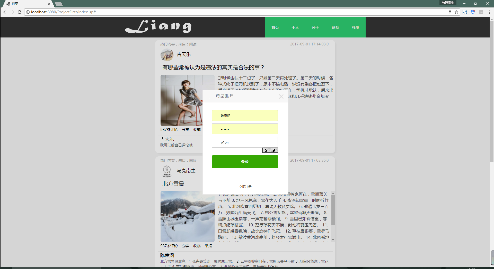
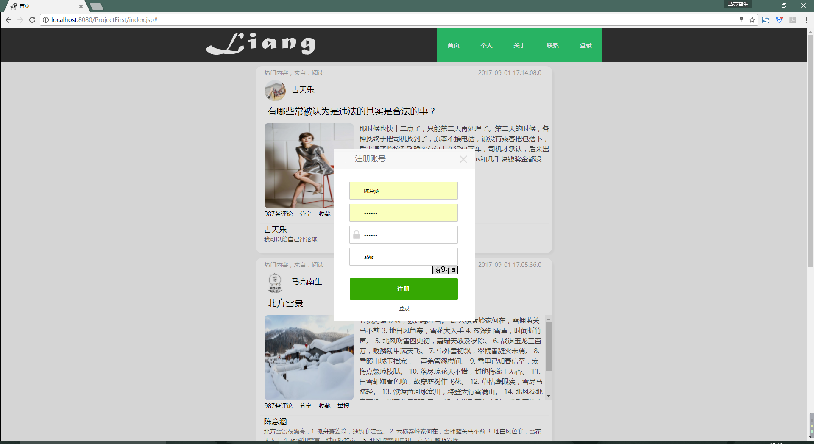
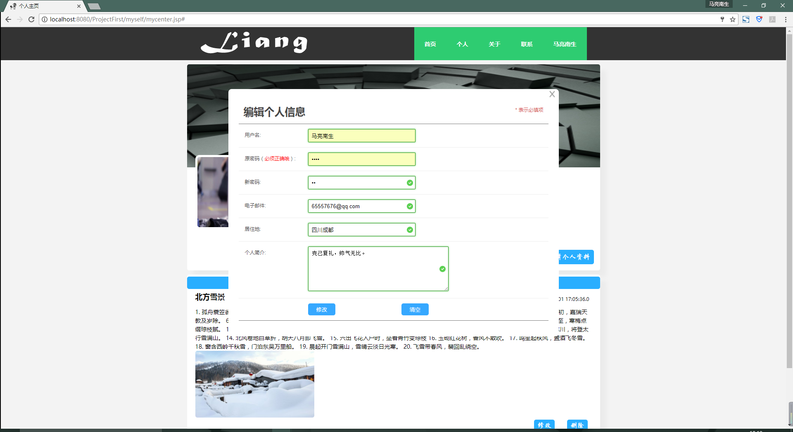
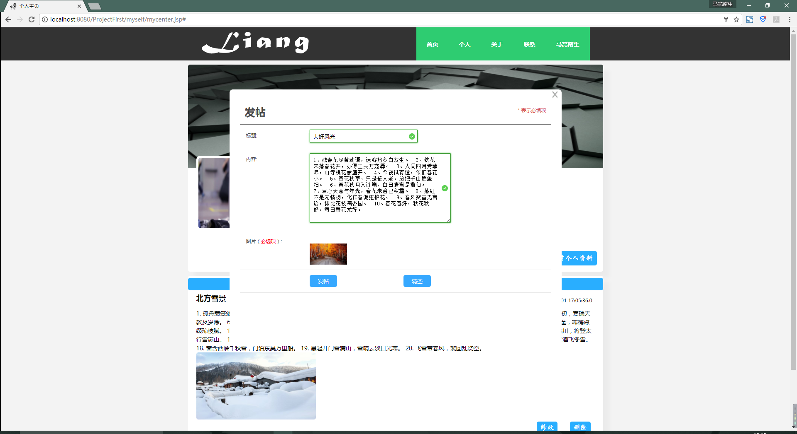
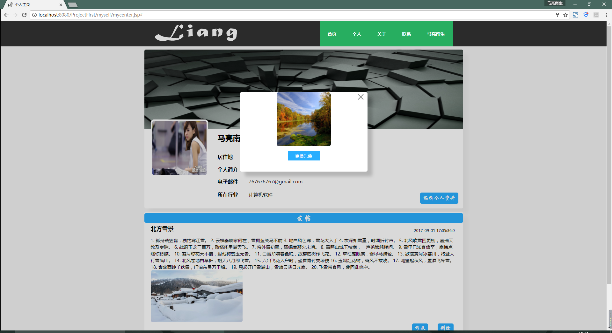

>>## 推荐：[我的另一个基于ssm的论坛项目](https://github.com/maliangnansheng/BBS_SSM)
>>### 这是一个界面美观，功能基本实现的论坛。
>>---
>>>> 可以直接使用，将项目导入eclipse，然后再把sql导入MySQL数据库就OK了。
>>---
>>## 如何将bbs.sql导入MySQL数据库：
>>1，创建数据库bbs：create database bbs;
>>
>>2，进入bbs数据库：use bbs;
>>
>>3，将bbs.sql导入bbs数据库：source 你的路径\bbs.sql;
>>### 技术栈
>>**jsp** **servlet** **javabean** **mysql** **html** **css** **javascript** **jQuery**
>>### 预览
>>#### 1，登录界面
>>>>##### 以弹窗的形式
>>>>
>>#### 2，注册界面
>>>>##### 以弹窗的形式
>>>>
>>#### 3，未登录时的首页
>>>>##### 此时游客是无法评论的
>>>>
>>#### 4，登录时的首页
>>>>##### 当然，现在你可以尽情的吐槽别人的话题了
>>>>
>>#### 5，他人主页
>>>>##### 可以看见他的个人信息和所有发过的帖子以及对应的评论
>>>>
>>#### 6，个人主页
>>>>##### 可以看见自己的个人信息和所有发过的帖子以及对应的评论，除此之外还可以编辑个人信息、更新头像、发表帖子
>>>>
>>#### 7，编辑个人信息
>>>>##### 对自己的信息进行编辑
>>>>
>>#### 8，发帖
>>>>##### 以弹窗的形式
>>>>
>>#### 9，更改头像
>>>>##### 以弹窗的形式
>>>>
